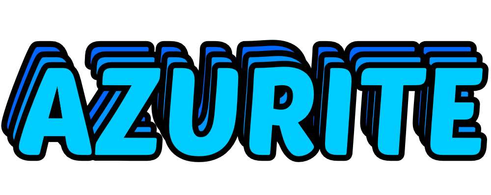

# Azurite

Welcome to Azurite, a platform for sharing and discovering mods for various games. It's similar to Thunderstore, but with a few tweaks to make it more user-friendly.

## Table of Contents

- [Introduction](#introduction)
- [Features](#features)
- [Demo](#demo)
- [Installation](#installation)
- [Usage](#usage)
- [Contributing](#contributing)
- [License](#license)

## Introduction

Azurite is a website where users can upload, share, and download mods for their favorite games. It provides a user-friendly interface for browsing mods, searching for specific ones, and managing your own uploads. I'm working on making it a mod manager too, but that's a ways off.

## Features

- **Exsists**: The site exsists! New stuff comming soon!

## Demo

[Link to Demo](azurite-dev.vercel.app) - Check out the demo if you want to see what it looks like in action.

## Installation

To run azurite locally, follow these steps:

1. Clone the repository: `git clone https://github.com/Abstractmelon/azurite.git`
2. Navigate to the project directory: `cd azurite`
3. Setup needed files: `pnpm run setup`
4. Start the development server: `pnpm run dev`

## Usage

Once the development server is running, you can access the site in your web browser at `http://localhost:5173`.

## Contributing

Contributions to Azurite are welcome! If you'd like to contribute, please follow these guidelines:

1. Fork the repository and create a new branch for your feature or bug fix.
2. Commit your changes with clear and descriptive messages.
3. Push your branch to your fork and submit a pull request to the main repository.

## License

This project is licensed under the [GNU v3 License](LICENSE). Feel free to use, modify, and distribute it as you see fit.
